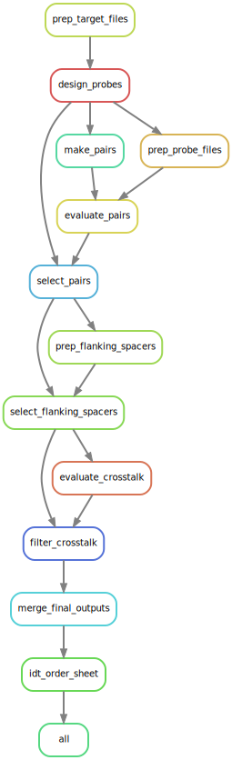

# README for Split Probe Design Pipeline
## Purpose
This pipeline is used to design "split probes" as per [HCR v3](http://doi.org/10.1242/dev.165753) and [split-FISH](https://doi.org/10.1038/s41592-020-0858-0).
The advantage here is that both probes are required to bind to the target site in order for fluorescence signal to appear.
This is meant to increase the probe specificity.
This probe design is based on brute-force design of all possible probes, then filtering based on specificity.


## Package requirements
[primer3](https://github.com/primer3-org/primer3)

[blastn](https://blast.ncbi.nlm.nih.gov/Blast.cgi?CMD=Web&PAGE_TYPE=BlastDocs&DOC_TYPE=Download)

snakemake=6.1.0

python=3.6

numpy=1.15.4

pandas=0.24.1

biopython=1.72

openpyxl=3.0.2


## Configuration
Use the config_example.yaml as a template and put your configuration file in the directory where you want to design probes. Make all of your filepaths in the configuration file relative to the directory where you want to design probes.

Create a blast database using
```
makeblastdb -in {DATABSE_FILE} -dbtype nucl -parse_seqids
```
Your inputs must be fasta files and there can be multiple targets in each input fasta.


## Execution
Execute the following in the command line


```
cd {PROBE_DESIGN_DIRECTORY}
snakemake --snakefile {PATH_TO_PIPELINE_DIRECTORY}/Snakefile \
          -j {NUMBER_OF_CORES} \
          --configfile {CONFIG_FILENAME}
```


## Workflow
Below is a rule graph of the Snakemake pipeline. Note that the rule 'prep_probe_files' is a checkpoint with the rules 'blast_probes' and 'filter_blasts' dependent on its output and thus not evaluated in the DAG until 'prep_probe_files' is complete. Thus 'blast_probes' and 'filter_blasts' fit between 'prep_probe_files' and 'evaluate_pairs'. The rule 'filter_blasts' also depends on the output of the rule 'target_alignments', which is also not shown in the rule graph.


[](./rulegraph.svg)

